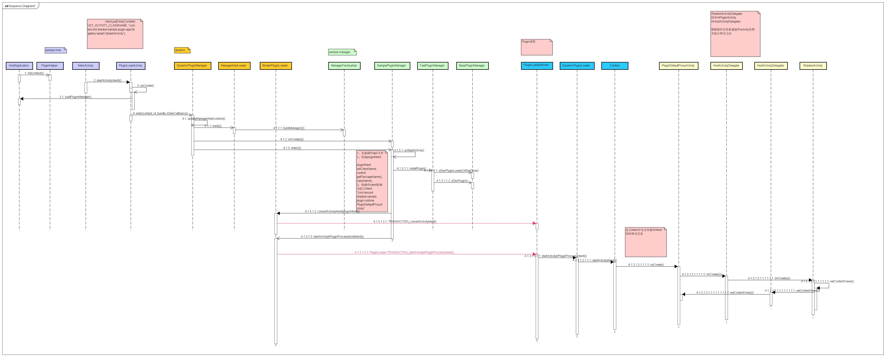

# Android插件化

##  一、插件化历史

2012 年 [AndroidDynamicLoader](https://github.com/mmin18/AndroidDynamicLoader) 给予 Fragment 实现了插件化框架，可以动态加载插件中的 Fragment 实现页面的切换。
2013 年 23Code 提供了一个壳，可以在壳里动态化下载插件然后运行。
2013 年 阿里技术沙龙上，伯奎做了 Atlas 插件化框架的分享，说明那时候阿里已经在做插件化的运用和开发了。
2014 年 任玉刚开源了 [dynamic-load-apk](https://github.com/singwhatiwanna/dynamic-load-apk)，通过代理分发的方式实现了动态化，如果看过 Android 开发艺术探索这本书，应该会对这个方式有了解。
2015 年 张勇 发布了 [DroidPlugin](https://github.com/DroidPluginTeam/DroidPlugin)，使用 hook 系统方式实现插件化。
2015 年 携程发布 [DynamicApk](https://github.com/CtripMobile/DynamicAPK)
2015 - 2016 之间（这块时间不太确定），Lody 发布了 [VirtualApp](https://github.com/asLody/VirtualApp)，可以直接运行未安装的 apk，基本上还是使用 hook 系统的方式实现的，不过里面的实现要精致很多，实现了自己的一套 AMS 来管理插件 Activity 等等。
2017 年阿里推出 [Atlas](https://github.com/apache/atlas)
2017 年 360 推出 [RePlugin](https://github.com/Qihoo360/RePlugin)
2017 年滴滴推出 [VirtualApk](https://github.com/didi/VirtualAPK)
2019 年腾讯推出了 [Shadow](https://github.com/Tencent/Shadow)，号称是零反射，并且框架自身也可实现动态化，看了代码以后发现，其实本质上还是使用了代理分发生命周期实现四大组件动态化，然后抽象接口来实现框架的动态化。后面有机会可以对其做一下分析。

这基本上就是插件化框架的历史，从 2012 至今，可以说插件化技术基本成型了，主要就是代理和 hook 系统两种方式。

## 二、概念解释

 在插件化中有一些专有名词，这里解释一下。
**宿主**
负责加载插件的 apk，一般来说就是已经安装的应用本身。

**插件**
可动态加载的apk，可远程下载并运行。

**StubActivity**
宿主中的占位 Activity，注册在宿主 Manifest 文件中，负责加载插件 Activity。

**PluginActivity**
插件 Activity，在插件 apk 中，没有注册在 Manifest 文件中，需要 StubActivity 来加载。 


## 三、关键技术

### 如何加载插件中的类

```java
package com.tencent.shadow.core.loader.classloaders

import android.os.Build
import com.tencent.shadow.core.runtime.PluginManifest
import dalvik.system.BaseDexClassLoader
import org.jetbrains.annotations.TestOnly
import java.io.File


/**
 * 用于加载插件的ClassLoader,插件内部的classLoader树结构如下
 *                       BootClassLoader
 *                              |
 *                      xxxClassLoader
 *                        |        |
 *               PathClassLoader   |
 *                 |               |
 *     PluginClassLoaderA  CombineClassLoader
 *                                 |
 *  PluginClassLoaderB        PluginClassLoaderC
 *
 */
class PluginClassLoader(
    dexPath: String,
    optimizedDirectory: File?,
    librarySearchPath: String?,
    parent: ClassLoader,
    private val specialClassLoader: ClassLoader?, hostWhiteList: Array<String>?
) : BaseDexClassLoader(dexPath, optimizedDirectory, librarySearchPath, parent) {

    /**
     * 宿主的白名单包名
     * 在白名单包里面的宿主类，插件才可以访问
     */
    private val allHostWhiteTrie = PackageNameTrie()

    private val loaderClassLoader = PluginClassLoader::class.java.classLoader!!

    init {
        hostWhiteList?.forEach {
            allHostWhiteTrie.insert(it)
        }

        //org.apache.commons.logging是非常特殊的的包,由系统放到App的PathClassLoader中.
        allHostWhiteTrie.insert("org.apache.commons.logging")

        //Android 9.0以下的系统里面带有http包，走系统的不走本地的
        if (Build.VERSION.SDK_INT < Build.VERSION_CODES.P) {
            allHostWhiteTrie.insert("org.apache.http")
            allHostWhiteTrie.insert("org.apache.http.**")
        }
    }

    @Throws(ClassNotFoundException::class)
    override fun loadClass(className: String, resolve: Boolean): Class<*> {
        var clazz: Class<*>? = findLoadedClass(className)

        if (clazz == null) {
            //specialClassLoader 为null 表示该classLoader依赖了其他的插件classLoader，需要遵循双亲委派
            if (specialClassLoader == null) {
                return super.loadClass(className, resolve)
            }

            //插件依赖跟loader一起打包的runtime类，如ShadowActivity，从loader的ClassLoader加载
            if (className.subStringBeforeDot() == "com.tencent.shadow.core.runtime") {
                return loaderClassLoader.loadClass(className)
            }

            //包名在白名单中的类按双亲委派逻辑，从宿主中加载
            if (className.inPackage(allHostWhiteTrie)) {
                return super.loadClass(className, resolve)
            }

            var suppressed: ClassNotFoundException? = null
            try {
                //正常的ClassLoader这里是parent.loadClass,插件用specialClassLoader以跳过parent
                clazz = specialClassLoader.loadClass(className)!!
            } catch (e: ClassNotFoundException) {
                suppressed = e
            }
            if (clazz == null) {
                try {
                    clazz = findClass(className)!!
                } catch (e: ClassNotFoundException) {
                    if (Build.VERSION.SDK_INT >= Build.VERSION_CODES.KITKAT) {
                        e.addSuppressed(suppressed)
                    }
                    throw e
                }

            }
        }

        return clazz
    }

    internal fun loadPluginManifest(): PluginManifest {
        try {
            val clazz = findClass("com.tencent.shadow.core.manifest_parser.PluginManifest")
            return PluginManifest::class.java.cast(clazz.newInstance())
        } catch (e: ClassNotFoundException) {
            throw Error(
                "请注意每个插件apk构建时都需要" +
                        "apply plugin: 'com.tencent.shadow.plugin'", e
            )
        }
    }

}

private fun String.subStringBeforeDot() = substringBeforeLast('.', "")

@Deprecated("use PackageNameTrie instead.")
@TestOnly
internal fun String.inPackage(packageNames: Array<String>): Boolean {
    val trie = PackageNameTrie()
    packageNames.forEach {
        trie.insert(it)
    }
    return inPackage(trie)
}

private fun String.inPackage(packageNames: PackageNameTrie): Boolean {
    val packageName = subStringBeforeDot()
    return packageNames.isMatch(packageName)
}

/**
 * 基于Trie算法对包名进行前缀匹配
 */
private class PackageNameTrie {
    private class Node {
        val subNodes = mutableMapOf<String, Node>()
        var isLastPackageOfARule = false
    }

    private val root = Node()

    fun insert(packageNameRule: String) {
        var node = root
        packageNameRule.split('.').forEach {
            if (it.isEmpty()) return //"",".*",".**"这种无包名情况不允许设置

            var subNode = node.subNodes[it]
            if (subNode == null) {
                subNode = Node()
                node.subNodes[it] = subNode
            }
            node = subNode
        }
        node.isLastPackageOfARule = true
    }

    fun isMatch(packageName: String): Boolean {
        var node = root

        val split = packageName.split('.')
        val lastIndex = split.size - 1
        for ((index, name) in split.withIndex()) {
            // 只要下级包名规则中有**，就完成了匹配
            val twoStars = node.subNodes["**"]
            if (twoStars != null) {
                return true
            }

            // 剩最后一级包名时，如果规则是*则完成比配
            if (index == lastIndex) {
                val oneStar = node.subNodes["*"]
                if (oneStar != null) {
                    return true
                }
            }

            // 找不到下级包名时即匹配失败
            val subNode = node.subNodes[name]
            if (subNode == null) {
                return false
            } else {
                node = subNode
            }
        }
        return node.isLastPackageOfARule
    }
}

```

### 如何加载插件中的资源

```kotlin
/*
 * Tencent is pleased to support the open source community by making Tencent Shadow available.
 * Copyright (C) 2019 THL A29 Limited, a Tencent company.  All rights reserved.
 *
 * Licensed under the BSD 3-Clause License (the "License"); you may not use
 * this file except in compliance with the License. You may obtain a copy of
 * the License at
 *
 *     https://opensource.org/licenses/BSD-3-Clause
 *
 * Unless required by applicable law or agreed to in writing, software
 * distributed under the License is distributed on an "AS IS" BASIS,
 * WITHOUT WARRANTIES OR CONDITIONS OF ANY KIND, either express or implied.
 * See the License for the specific language governing permissions and
 * limitations under the License.
 *
 */

package com.tencent.shadow.core.loader.blocs

import android.annotation.TargetApi
import android.content.Context
import android.content.pm.ApplicationInfo
import android.content.pm.PackageManager
import android.content.res.Configuration
import android.content.res.Resources
import android.content.res.XmlResourceParser
import android.os.Build
import android.os.Bundle
import android.os.Handler
import android.os.Looper
import android.util.AttributeSet
import android.util.DisplayMetrics
import android.util.TypedValue
import android.webkit.WebView
import java.util.concurrent.CountDownLatch

object CreateResourceBloc {
    fun create(archiveFilePath: String, hostAppContext: Context): Resources {
        triggerWebViewHookResources(hostAppContext)

        val packageManager = hostAppContext.packageManager
        val applicationInfo = ApplicationInfo()
        val hostApplicationInfo = hostAppContext.applicationInfo
        applicationInfo.packageName = hostApplicationInfo.packageName
        applicationInfo.uid = hostApplicationInfo.uid

        if (Build.VERSION.SDK_INT >= Build.VERSION_CODES.O) {
            fillApplicationInfoForNewerApi(applicationInfo, hostApplicationInfo, archiveFilePath)
        } else {
            fillApplicationInfoForLowerApi(applicationInfo, hostApplicationInfo, archiveFilePath)
        }

        try {
            val pluginResource = packageManager.getResourcesForApplication(applicationInfo)

            return if (Build.VERSION.SDK_INT >= Build.VERSION_CODES.O) {
                pluginResource
            } else {
                val hostResources = hostAppContext.resources
                MixResources(pluginResource, hostResources)
            }
        } catch (e: PackageManager.NameNotFoundException) {
            throw RuntimeException(e)
        }

    }

    /**
     * WebView初始化时会向系统构造的Resources对象注入webview.apk，
     * 以便WebView可以使用自己的资源。
     *
     * 由于它不会向插件构造的Resources对象注入apk，
     * 所以我们先初始化它，让它注入给宿主，等插件构造Resources时从宿主中复制出该apk路径。
     */
    private fun triggerWebViewHookResources(hostAppContext: Context) {
        //先用宿主context初始化一个WebView，以便WebView的逻辑去修改sharedLibraryFiles，将webview.apk添加进去
        val latch = CountDownLatch(1)
        Handler(Looper.getMainLooper()).post {
            try {
                WebView(hostAppContext)
            } catch (ignored: Exception) {
                // API 26虚拟机报No WebView installed
            }
            latch.countDown()
        }
        latch.await()
    }

    private fun fillApplicationInfoForNewerApi(
        applicationInfo: ApplicationInfo,
        hostApplicationInfo: ApplicationInfo,
        pluginApkPath: String
    ) {
        /**
         * 这里虽然sourceDir和sharedLibraryFiles中指定的apk都会进入Resources对象，
         * 但是只有资源id分区大于0x7f时才能在加载之后保持住资源id分区。
         * 如果把宿主的apk路径放到sharedLibraryFiles中，我们假设宿主资源id分区是0x7f，
         * 则加载后会变为一个随机的分区，如0x30。因此放入sharedLibraryFiles中的apk的
         * 资源id分区都需要改为0x80或更大的值。
         *
         * 考虑到现网可能已经有旧方案运行的宿主和插件，而宿主不易更新。
         * 因此新方案假设宿主保持0x7f固定不能修改，但是插件可以重新编译新版本修改资源id分区。
         * 因此把插件apk路径放到sharedLibraryFiles中。
         *
         * 复制宿主的sharedLibraryFiles，主要是为了获取前面WebView初始化时，
         * 系统使用私有API注入的webview.apk
         */
        applicationInfo.publicSourceDir = hostApplicationInfo.publicSourceDir
        applicationInfo.sourceDir = hostApplicationInfo.sourceDir

        // hostSharedLibraryFiles中可能有webview通过私有api注入的webview.apk
        val hostSharedLibraryFiles = hostApplicationInfo.sharedLibraryFiles
        val otherApksAddToResources =
            if (hostSharedLibraryFiles == null)
                arrayOf(pluginApkPath)
            else
                arrayOf(
                    *hostSharedLibraryFiles,
                    pluginApkPath
                )

        applicationInfo.sharedLibraryFiles = otherApksAddToResources
    }

    /**
     * API 25及以下系统，单独构造插件资源
     */
    private fun fillApplicationInfoForLowerApi(
        applicationInfo: ApplicationInfo,
        hostApplicationInfo: ApplicationInfo,
        pluginApkPath: String
    ) {
        applicationInfo.publicSourceDir = pluginApkPath
        applicationInfo.sourceDir = pluginApkPath
        applicationInfo.sharedLibraryFiles = hostApplicationInfo.sharedLibraryFiles
    }
}

/**
 * 在API 25及以下代替设置sharedLibraryFiles后通过getResourcesForApplication创建资源的方案。
 * 因调用addAssetPath方法也无法满足CreateResourceTest涉及的场景。
 */
@Suppress("DEPRECATION", "OVERRIDE_DEPRECATION")
@TargetApi(25)
private class MixResources(
    private val mainResources: Resources,
    private val sharedResources: Resources
) : Resources(mainResources.assets, mainResources.displayMetrics, mainResources.configuration) {

    private var beforeInitDone = false
    private var updateConfigurationCalledInInit = false

    /**
     * 低版本系统中Resources构造器中会调用updateConfiguration方法，
     * 此时mainResources还没有初始化。
     */
    init {
        if (updateConfigurationCalledInInit) {
            updateConfiguration(mainResources.configuration, mainResources.displayMetrics)
        }
        beforeInitDone = true
    }

    private fun <R> tryMainThenShared(function: (res: Resources) -> R) = try {
        function(mainResources)
    } catch (e: NotFoundException) {
        function(sharedResources)
    }

    override fun getText(id: Int) = tryMainThenShared { it.getText(id) }

    override fun getText(id: Int, def: CharSequence?) = tryMainThenShared { it.getText(id, def) }

    override fun getQuantityText(id: Int, quantity: Int) =
        tryMainThenShared { it.getQuantityText(id, quantity) }

    override fun getString(id: Int) =
        tryMainThenShared { it.getString(id) }

    override fun getString(id: Int, vararg formatArgs: Any?) =
        tryMainThenShared { it.getString(id, *formatArgs) }


    override fun getQuantityString(id: Int, quantity: Int, vararg formatArgs: Any?) =
        tryMainThenShared { it.getQuantityString(id, quantity, *formatArgs) }

    override fun getQuantityString(id: Int, quantity: Int) =
        tryMainThenShared {
            it.getQuantityString(id, quantity)
        }

    override fun getTextArray(id: Int) =
        tryMainThenShared {
            it.getTextArray(id)
        }

    override fun getStringArray(id: Int) =
        tryMainThenShared {
            it.getStringArray(id)
        }

    override fun getIntArray(id: Int) =
        tryMainThenShared {
            it.getIntArray(id)
        }

    override fun obtainTypedArray(id: Int) =
        tryMainThenShared {
            it.obtainTypedArray(id)
        }

    override fun getDimension(id: Int) =
        tryMainThenShared {
            it.getDimension(id)
        }

    override fun getDimensionPixelOffset(id: Int) =
        tryMainThenShared {
            it.getDimensionPixelOffset(id)
        }

    override fun getDimensionPixelSize(id: Int) =
        tryMainThenShared {
            it.getDimensionPixelSize(id)
        }

    override fun getFraction(id: Int, base: Int, pbase: Int) =
        tryMainThenShared {
            it.getFraction(id, base, pbase)
        }

    override fun getDrawable(id: Int) =
        tryMainThenShared {
            it.getDrawable(id)
        }

    override fun getDrawable(id: Int, theme: Theme?) =
        tryMainThenShared {
            it.getDrawable(id, theme)
        }

    override fun getDrawableForDensity(id: Int, density: Int) =
        tryMainThenShared {
            it.getDrawableForDensity(id, density)
        }

    override fun getDrawableForDensity(id: Int, density: Int, theme: Theme?) =
        tryMainThenShared {
            it.getDrawableForDensity(id, density, theme)
        }

    override fun getMovie(id: Int) =
        tryMainThenShared {
            it.getMovie(id)
        }

    override fun getColor(id: Int) =
        tryMainThenShared {
            it.getColor(id)
        }

    override fun getColor(id: Int, theme: Theme?) =
        tryMainThenShared {
            it.getColor(id, theme)
        }

    override fun getColorStateList(id: Int) =
        tryMainThenShared {
            it.getColorStateList(id)
        }

    override fun getColorStateList(id: Int, theme: Theme?) =
        tryMainThenShared {
            it.getColorStateList(id, theme)
        }

    override fun getBoolean(id: Int) =
        tryMainThenShared {
            it.getBoolean(id)
        }

    override fun getInteger(id: Int) =
        tryMainThenShared {
            it.getInteger(id)
        }

    override fun getLayout(id: Int) =
        tryMainThenShared {
            it.getLayout(id)
        }

    override fun getAnimation(id: Int) =
        tryMainThenShared {
            it.getAnimation(id)
        }

    override fun getXml(id: Int) =
        tryMainThenShared {
            it.getXml(id)
        }

    override fun openRawResource(id: Int) =
        tryMainThenShared {
            it.openRawResource(id)
        }

    override fun openRawResource(id: Int, value: TypedValue?) =
        tryMainThenShared {
            it.openRawResource(id, value)
        }

    override fun openRawResourceFd(id: Int) =
        tryMainThenShared {
            it.openRawResourceFd(id)
        }

    override fun getValue(id: Int, outValue: TypedValue?, resolveRefs: Boolean) =
        tryMainThenShared {
            it.getValue(id, outValue, resolveRefs)
        }

    override fun getValue(name: String?, outValue: TypedValue?, resolveRefs: Boolean) =
        tryMainThenShared {
            it.getValue(name, outValue, resolveRefs)
        }

    override fun getValueForDensity(
        id: Int,
        density: Int,
        outValue: TypedValue?,
        resolveRefs: Boolean
    ) =
        tryMainThenShared {
            it.getValueForDensity(id, density, outValue, resolveRefs)
        }

    override fun obtainAttributes(set: AttributeSet?, attrs: IntArray?) =
        tryMainThenShared {
            it.obtainAttributes(set, attrs)
        }

    override fun updateConfiguration(config: Configuration?, metrics: DisplayMetrics?) {
        if (beforeInitDone) {
            tryMainThenShared {
                it.updateConfiguration(config, metrics)
            }
        }
    }

    override fun getDisplayMetrics() =
        tryMainThenShared {
            it.getDisplayMetrics()
        }

    override fun getConfiguration() =
        tryMainThenShared {
            it.getConfiguration()
        }

    override fun getIdentifier(name: String?, defType: String?, defPackage: String?) =
        tryMainThenShared {
            it.getIdentifier(name, defType, defPackage)
        }

    override fun getResourceName(resid: Int) =
        tryMainThenShared {
            it.getResourceName(resid)
        }

    override fun getResourcePackageName(resid: Int) =
        tryMainThenShared {
            it.getResourcePackageName(resid)
        }

    override fun getResourceTypeName(resid: Int) =
        tryMainThenShared {
            it.getResourceTypeName(resid)
        }

    override fun getResourceEntryName(resid: Int) =
        tryMainThenShared {
            it.getResourceEntryName(resid)
        }

    override fun parseBundleExtras(parser: XmlResourceParser?, outBundle: Bundle?) =
        tryMainThenShared {
            it.parseBundleExtras(parser, outBundle)
        }

    override fun parseBundleExtra(tagName: String?, attrs: AttributeSet?, outBundle: Bundle?) =
        tryMainThenShared {
            it.parseBundleExtra(tagName, attrs, outBundle)
        }
}
```


## Shadow应用组成

host：宿主应用，在Manifest中注册了壳子代理组件

manager：插件管理器，负责下载、安装插件。manager在加载"插件"时，首先需要先加载"插件"中的runtime和loader，再通过loader的Binder（插件应该处于独立进程中避免native库冲突）操作loader进而加载业务App。

loader：业务主要在这里定义插件组件和壳子代理组件的配对关系等

runtime：业务主要在这里定义壳子代理组件的实际类

### 宿主应用

由如下几个部分组成：

- host：壳应用，在Manifest中注册了壳子代理组件
- manager：插件管理器的动态实现，负责下载、安装插件

### 插件应用

由如下几个部分组成：

- 插件loader：loader的动态实现，业务主要在这里定义插件组件和壳子代理组件的配对关系等。
- 插件runtime：runtime的动态实现，业务主要在这里定义壳子代理组件的实际类。




参考：

https://github.com/5A59/android-training/blob/master/common-tec/android-%E6%8F%92%E4%BB%B6%E5%8C%96.md


